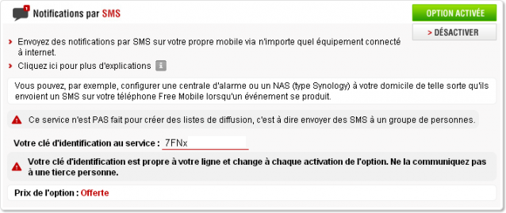

# Laravel Free Mobile SMS

[](https://scrutinizer-ci.com/g/AkibaTech/laravel-free-mobile-sms/build-status/master) [](https://scrutinizer-ci.com/g/AkibaTech/laravel-free-mobile-sms/?branch=master)

Ce paquet vous permet d'**envoyer extrêment facilement** des **notifications SMS** sur votre **téléphone Free Mobile** depuis votre application Laravel 5.  

Si vous êtes chez **Free Mobile**, cette option est gratuite ! Ne vous en privez pas :)

- [Site Free Mobile](https://mobile.free.fr)
- Actualité : ["Nouvelle option « Notifications par SMS » chez Free Mobile"](https://www.freenews.fr/freenews-edition-nationale-299/free-mobile-170/nouvelle-option-notifications-par-sms-chez-free-mobile-14817)

## Sommaire

- [Installation](#installation)
- [Usage](#usage)
- [Laravel Notifications](#laravel-notifications)
    - [Exemple](#exemple)
- [Obtenir vos identifiants](#obtenir-vos-identifiants)
- [Support](#support)
- [Auteur](#auteur)
- [Licence](#licence)

## Installation

Installer ce paquet avec Composer:  
```bash
composer require akibatech/laravel-free-mobile-sms
```

Ajoutez le ServiceProvider dans **config/app.php**:  
```php
Akibatech\FreeMobileSms\ServiceProvider::class,
```

Si vous souhaitez utiliser la facade, incluez la dans ce même fichier de config:  
```php
'Freemobile' => Akibatech\FreeMobileSms\Facade::class,
```

Ensuite, publiez le fichier de config **laravel-free-mobile-sms** en tapant la commande suivante:  
```bash
php artisan vendor:publish --provider="Akibatech\FreeMobileSms\ServiceProvider"
```

## Usage

Envoyer un sms sur votre téléphone :
```php
FreeMobileSms::send('Elle est où la poulette !?');
```

Envoyer un sms en passant l'instance en paramètre (DI) :
```php
public function myControllerAction(Akibatech\FreeMobileSms\FreeMobileSms $client)
{
    $sms->send('Pas changer assiette pour fromage !');
}
```

Ou bien, récupérer l'instance depuis le container :
```php
public function myControllerAction()
{
    app('freemobile')->send("C'est pas faux.");
}
```

## Laravel Notifications

Si vous êtes sous Laravel 5.3, vous pouvez utiliser ce paquet en tant que driver pour Laravel Notifications.

### Exemple 

```php
namespace App\Notifications;

use Akibatech\FreeMobileSms\Notifications\FreeMobileChannel;
use Akibatech\FreeMobileSms\Notifications\FreeMobileMessage;
use Illuminate\Notifications\Notification;

class ExampleNotification extends Notification
{
    /**
     * Notification via FreeMobileChannel.
     */
    public function via($notifiable)
    {
        return [FreeMobileChannel::class];
    }

    /**
     * Your notification must implements "toFreeMobile()"
     */
    public function toFreeMobile($notifiable)
    {
    	return (new FreeMobileMessage("C'est marrant les petits bouts de fromage par terre. C'est ça que vous appelez une fondue ?"));
    }
}
```

Voilà, vous pouvez maintenant utiliser votre téléphone Free Mobile pour recevoir vos notifications SMS gratuitement :)

## Obtenir vos identifiants

C'est très simple, rendez-vous sur votre [espace abonné Free Mobile](https://mobile.free.fr/moncompte/) puis dans la section **Gérer mon compte**, sous-menu **Mes options**.

Vous trouverez vos identifiants comme sur la capture ci-dessous.  



Une fois vos identifiants en main, ajoutez-les dans le fichier **config/laravel-free-mobile-sms.php**.  
Il vous est possible de les configurer dans le fichier **.env** qui n'est pas versionné.  

- FREE_USER => vos identifiant client (8 chiffres)
- FREE_PASS => votre clé d'identification SMS

## Support

N'hésitez pas à utiliser le gestion d'issus pour vos retours.

## Auteur

[Marceau Casals](https://marceau.casals.fr)

## Licence

MIT
